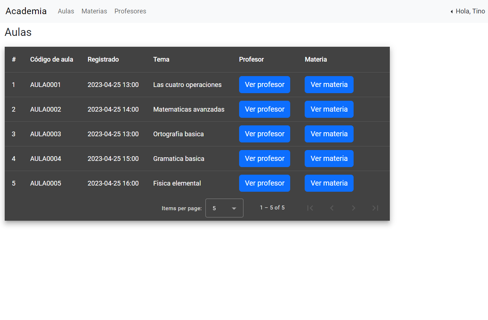

# Academia frontend

## Requisitos
Levantar el backend: https://github.com/tinoreyna1984/academia

## Dependencias empleadas
* @angular/material, v16.2.12
* bootstrap, v5.3.2
* jquery, v3.7.1
* @popperjs/core, v2.11.8
* jwt-decode, v3.1.2
* sweetalert2, v11.9.0

## Instalación y ejecución
```bash
cd academia-front
npm i
ng serve -o
```

## Login de prueba (par usuario/clave)
* admin/Tr20010878 (administrador)
* treyna/u$uari0CRM (usuario)

## Instrucciones de uso

1. Inicio de sesión


2. Ingresar datos y hacer click en "Ingresar"


3. Se entra al sistema. La pantalla principal es la de Aulas. Cabe destacar que el usuario solo puede leer la información registrada, de modo que la modificación de los datos vía CRUD está restringida a los administradores:




Se agrega también que la gestión de usuarios también está restringida a los administradores.

4. Se pueden visualizar, en el caso de las aulas, los valores relacionados de Profesor y Materia:


5. Los administradores pueden agregar, modificar y eliminar registros de todas las entidades del sistema:

Agregar:


Modificar:


Eliminar:


## Casos particulares

Cuando ocurre un problema de ingreso de valores, se disparan mensajes de error. Por ejemplo, al ingresar mal las credenciales:


Y después de tres reintentos la cuenta se bloquea:


